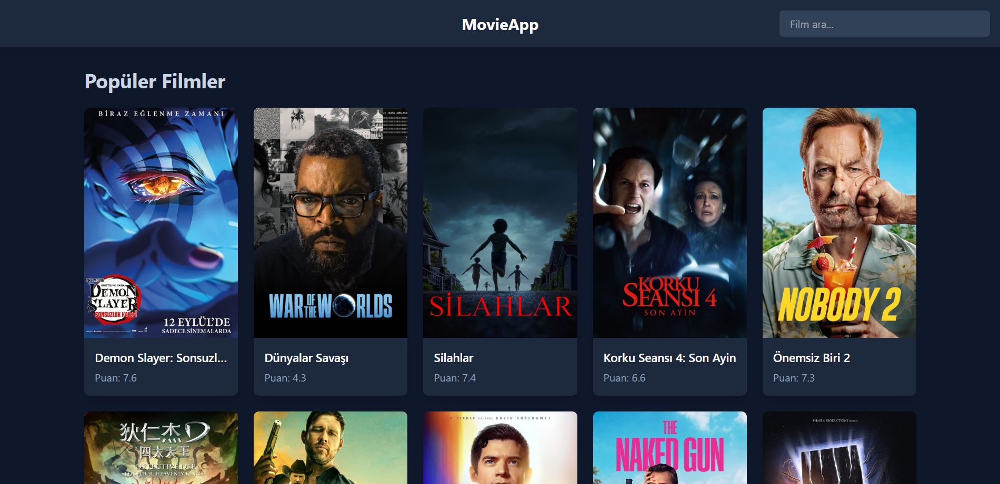

# React Movie App with TypeScript & Tailwind CSS



> A modern and responsive web application for browsing, searching, and favoriting movies, built from scratch with React, TypeScript, and Tailwind CSS. This project leverages the [The Movie Database (TMDB) API](https://www.themoviedb.org/documentation/api) to provide up-to-date movie information.

**[➡️ View Live Demo](https://react-ts-movie-app-demo-j064oskl2-onuryazicis-projects.vercel.app/)**

---

## ✨ Features

- **Browse Popular Movies**: View a grid of the most popular movies currently trending.
- **Real-time Search**: Search for movies by title with instant results.
- **Optimized API Requests**: Implemented a custom `useDebounce` hook to prevent excessive API calls while typing.
- **Detailed Movie Information**: Click on any movie to see a dedicated page with its poster, summary, rating, runtime, and more.
- **Favorites System**: Add or remove movies from a personal "Favorites" list.
- **Persistent Data**: Favorites are saved to the browser's `localStorage`, so they persist across sessions.
- **Fully Responsive Design**: The UI is built with Tailwind CSS and adapts beautifully to all screen sizes, from mobile to desktop.

## 🚀 Tech Stack

- **Framework**: [React](https://reactjs.org/)
- **Language**: [TypeScript](https://www.typescriptlang.org/)
- **Build Tool**: [Vite](https://vitejs.dev/)
- **Styling**: [Tailwind CSS](https://tailwindcss.com/)
- **Routing**: [React Router DOM](https://reactrouter.com/)
- **API Communication**: [Axios](https://axios-http.com/)
- **Data Source**: [The Movie Database (TMDB) API](https://www.themoviedb.org/documentation/api)

## 🛠️ Getting Started

To get a local copy up and running, follow these simple steps.

### Prerequisites

- Node.js (v18 or higher recommended)
- npm or yarn

### Installation

1.  **Clone the repository:**

    ```sh
    git clone https://github.com/onuryaziici/react-ts-movie-app.git
    ```

2.  **Navigate to the project directory:**

    ```sh
    cd react-ts-movie-app
    ```

3.  **Install NPM packages:**

    ```sh
    npm install
    ```

4.  **Set up environment variables:**

    - Create a new file named `.env.local` in the root of your project.
    - Get a free API key from [The Movie Database (TMDB)](https://www.themoviedb.org/settings/api).
    - Add your API key to the `.env.local` file:
      ```
      VITE_API_KEY="YOUR_TMDB_API_KEY_HERE"
      ```

5.  **Run the development server:**
    ```sh
    npm run dev
    ```
    The application will be available at `http://localhost:5173`.

## 📈 Future Improvements

While the core functionality is complete, here are some ideas for future enhancements:

- **Dedicated Favorites Page**: Create a new route (`/favorites`) to display all favorited movies.
- **Pagination**: Implement pagination for movie lists to handle large numbers of results.
- **Advanced Loading & Error States**: Use skeleton loaders for a better user experience while data is being fetched.
- **Genre Filtering**: Allow users to filter movies by genre.

## 📄 License

Distributed under the MIT License. See `LICENSE` for more information.
